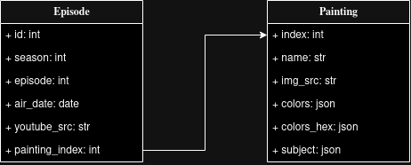

# atlas-the-joy-of-painting-api

[](https://www.linkedin.com/in/willow-morris-pretzelogic)


This project uses the concepts of ETL (extract, transform, load) to take different unorganized but related data sources and storing them in a SQL server. The chosen data source was information from the tv show The Joy of Painting starring Bob Ross. I combined 3 csv files into a single SQL file using python. Since the data was only going to be read and not changed I decided to package the data together with the SQL server in a docker container by placing the generated file in /docker-entrypoint-initdb.d which runs whatever sql file is in the folder on launch.

By far the hardest part was creating the SQL code that is sent to the server. Both because I was using mySQL's JSON functions which leave a bit to be desired and I was manually building each SQL statement. There is also implementing guards against SQL injection attacks which is performed in api/check_query.py. Next time I have to do a database I am thinking of either using an ORM or trying a new database paradigm.

# Requirements
    Docker
    python 3.10^
    python-mysql-connector 8.3.0^


UML documentation is done with [draw.io](https://draw.io)

# SQL server (./sql)

SQL server runs as a docker container. To build and run use these commands inside the sql folder. The api server's user is set as read only since the data will not need to be modified afterwards.

```
cd sql
make build
make run
```

# ETL (./ETL)

Extracts data from the given data files and generates a sql file to be used in the SQL server. Also gets all the possible options for the colors and subject

```
cd ETL
# get init.sql
./main.py
cp init.sql ../sql/init.sql
# get options
./get_all_opts.py
```

# api (./api)

Api with a single (/episodes) endpoint that queries the sql server for episodes that matches all/one or more of the episode air month, painting subject and painting color pallete.

This is the shape of the json query. Values in [] are the accepted values which are contained in (./check_query.py)

```
{
    "match": [match_accepted],
    "month": "YYYY-MM-DD"  # in range date_accepted
    "colors": [colors_accepted]
    "subject": [subject_accepted]
    "fields": [fields_accepted]
}
```


To run

```
cd ./api
python3 app.py
```